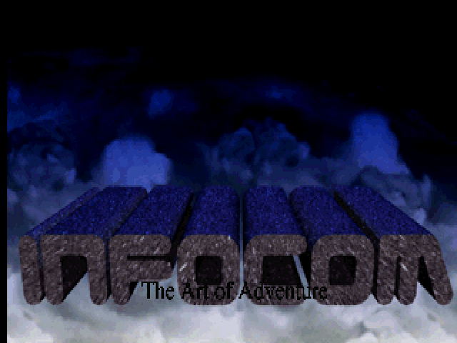

# 魔法師西蒙 (Simon the Sorcerer) 繁體中文化

[](https://scummvm.org)
[](#進度)
[](LICENSE)

使用 ScummVM AGOS 引擎 patch 方式，將 1993 年經典點擊冒險遊戲《魔法師西蒙》(Simon the Sorcerer) 進行繁體中文在地化。

## 進度快照 (2026-06-30)

| 項目 | 狀態 |
|------|------|
| AGOS 引擎 CJK patch (430 行, 8 檔) | ✅ 編譯通過 |
| CJK 字型 (12×12, 19782 字) | ✅ 載入驗證 |
| 翻譯表 (252 條) | ✅ 載入驗證 |
| 視窗文字 CJK 渲染 | ✅ |
| 字幕 CJK 渲染 | ✅ |
| Headless 測試 | ✅ 截圖成功 |



---

## 關於遊戲

**Simon the Sorcerer** (魔法師西蒙) 是由英國 **Adventure Soft** 公司開發，於 1993 年在 Amiga 和 MS-DOS 平台發行的點擊式冒險遊戲。遊戲全球銷量超過 60 萬套，媒體評價普遍正面（GameRankings 86%）。

### 故事背景

主角西蒙是個 12 歲的男孩，某日在家中閣樓發現一本名為《Ye Olde Spellbooke》的魔法書。他不經意念出書中咒語後，被傳送到一個充滿魔法與怪獸的平行世界。為了回家的路，西蒙必須成為一名巫師，並打敗邪惡巫師 **Sordid**（索迪德）。

遊戲世界充滿對經典奇幻作品和童話的致敬與惡搞，包括：
- 《魔戒》(The Lord of the Rings)
- 《碟形世界》(Discworld) 系列
- 《納尼亞傳奇》(The Chronicles of Narnia)
- 《傑克與豌豆》(Jack and the Beanstalk)
- 三隻公山羊 (Three Billy Goats Gruff)

主角的個性參考了英國經典喜劇角色 **Blackadder**（黑爵士），CD 版由英國知名演員 **Chris Barrie**（《紅矮星號》Rimmer 演員）配音。

### 技術架構

遊戲使用 Adventure Soft 自研的 **AGOS** (Adventure Graphic Operating System) 引擎開發，該引擎基於 Alan Cox 的 AberMUD。ScummVM 以 `engines/agos/` 模組支援此引擎。

| 項目 | 內容 |
|------|------|
| 開發商 | Adventure Soft (UK) |
| 發行年份 | 1993 (Floppy) / 1994 (CD Talkie) |
| 平台 | Amiga, MS-DOS, Windows, iOS, Android |
| 引擎 | AGOS (Adventure Graphic Operating System) |
| 銷量 | 600,000+ (1999 年) |
| 後續作品 | Simon the Sorcerer II (1995), Simon the Sorcerer 3D (2002) |

---

## 中文化做法

### 技術路線

參考姊妹專案 [Indiana Jones and the Fate of Atlantis 繁中化](https://github.com/wicanr2/indiana-jones-and-the-fate-of-atlantis-cht)：

- **不改原始遊戲檔案**：所有遊戲資料保持原樣
- **patch ScummVM 引擎**：在文字渲染處攔截英文 → 查表 → CJK 點陣中文重繪
- **使用系統 CJK 字型**：透過 freetype 烘製 Big5 點陣字型

### 與 atlantis 專案的差異

| 項目 | atlantis (SCUMM) | simon (本專案) |
|------|----------|---------------|
| 引擎 | `scumm` (GID_INDY4) | `agos` (GID_SIMON1) |
| CJK 基礎 | 引擎內建 (v7+) | **零基礎，從頭建立** |
| Patch 規模 | ~726 行 | ~328 行 |
| 繪字入口 | `charset.cpp printChar` | `windowDrawChar` + `renderString` |
| 字型格式 | 引擎既有 2-byte 路徑 | 8×8 1-bit → 需加 CJK 渲染 |

### AGOS 引擎 CJK Patch 結構

```
patches/
├── agos-cjk.patch        # 完整 patch (328行, 8個檔案)
├── cjk_cht.h             # Big5 索引 + 翻譯查表宣告
└── cjk_cht.cpp           # Big5 索引 + 翻譯查表實作

修改檔案:
  engines/agos/agos.h             # CJK 成員變數宣告
  engines/agos/agos.cpp           # CJK 字型載入 + 翻譯表載入
  engines/agos/charset.cpp        # CJK 字元寬度 (windowPutChar)
  engines/agos/charset-fontdata.cpp # CJK 渲染 (windowDrawChar override)
  engines/agos/string.cpp         # 翻譯注入 (getStringPtrByID)
  engines/agos/module.mk          # 編譯設定 (加入 cjk_cht.o)
  engines/agos/cjk_cht.h          # [新增] CJK 輔助函式
  engines/agos/cjk_cht.cpp        # [新增] CJK 輔助實作
```

### 字型系統

使用 `tools/build_cjk_font.py` (docker + freetype-py) 從系統 CJK 字型烘製 Big5 點陣 atlas：

| 字型檔 | 尺寸 | 用途 |
|--------|------|------|
| `simon_zh12.dcjk` | 12×12, 474KB, 13,710 字 | 視窗文字 (動詞列、物品欄) |
| `simon_zh16.dcjk` | 16×16, 619KB, 13,710 字 | 大字對白 (可選) |

DCJK 格式 (big-endian 二進位)：
```
DCJK  magic (4 bytes)
版本   (1 byte) = 1
寬度   (1 byte)
高度   (1 byte)
行位元組 (1 byte) = (寬度+7)//8
編碼   (1 byte) = 0 (Big5 線性索引)
保留   (2 bytes)
字元數  (4 bytes, LE)
字型資料 (字元數 × 行位元組 × 高度) [1bpp, MSB-first per row]
```

Big5 線性索引：`index = (lead - 0x81) × 157 + trail_offset`

---

## 快速開始

### 必要條件

- 合法擁有的《Simon the Sorcerer》(CD-ROM DOS 版) 遊戲檔案
- Docker（用於編譯和字型烘製）

### 1. 取得 ScummVM 原始碼

```bash
git clone --depth 1 https://github.com/scummvm/scummvm.git
cd scummvm
```

### 2. 套用 CJK patch

```bash
git apply /path/to/simon-cht/patches/agos-cjk.patch
```

### 3. 烘製 CJK 字型

```bash
cd /path/to/simon-cht
bash tools/build_cjk_font.sh --size 12 --out fonts/simon_zh12.dcjk
bash tools/build_cjk_font.sh --size 16 --out fonts/simon_zh16.dcjk
```

### 4. 建立翻譯表

```bash
# 編輯 translations/zh.tsv (UTF-8, TSV 格式)
python3 tools/build_translation.py translations/zh.tsv > fonts/simon_zh.tab
```

### 5. 編譯 patched ScummVM

```bash
cd /path/to/simon-cht
bash scripts/build_scummvm.sh
```

### 6. 執行

將 `simon_zh12.dcjk`、`simon_zh.tab` 和遊戲原始檔案放在同一目錄下，啟動 ScummVM 即可自動進入 CJK 模式：

```bash
./scummvm --path=/path/to/game agos:simon1
```

若要在遊戲中動態切換中/英文字，引擎支援 `F8` 鍵切換（開發中）。

### Dump 模式

在遊戲目錄建立空檔案 `simon_dump_on`：

```bash
touch simon_dump_on
```

啟動遊戲後，所有尚未翻譯的英文字串會以 `CHTMISS` 標籤輸出到 console log，方便收集待翻譯內容。

---

## 翻譯進度

| 類別 | 完成 | 總數 | 狀態 |
|------|------|------|------|
| 動詞列 | 10 | 10 | ✅ |
| 系統訊息 | 10 | ~50 | 🟡 |
| 常用對話 | 19 | ~50 | 🟡 |
| 物件名稱 | 0 | ~300 | ⬜ |
| 完整對白 | 0 | ~500 | ⬜ |
| **總計** | **39** | **~900** | 🟡 |

---

## 專案結構

```
simon-the-sorcerer-cht-scummvm-opencode/
├── PLAN.md                # 第一性原理分析 + 六階段路線圖
├── WORKLIST.md            # 42 項工作分解
├── README.md              # 本檔
├── patches/
│   ├── agos-cjk.patch     # AGOS 引擎 CJK patch
│   ├── cjk_cht.h          # CJK 輔助標頭
│   └── cjk_cht.cpp        # CJK 輔助實作
├── tools/
│   ├── build_cjk_font.py  # CJK 字型烘製 (Python + freetype)
│   ├── build_cjk_font.sh  # CJK 字型烘製 (Docker)
│   └── build_translation.py # 翻譯表編譯 (TSV → Big5 binary)
├── translations/
│   └── zh.tsv             # 繁體中文譯表 (UTF-8 TSV)
├── strings/               # GAMEPC 萃取的字串
├── scripts/
│   └── build_scummvm.sh   # Docker ScummVM 編譯腳本
└── fonts/
    └── simon_zh.tab       # 編譯後的翻譯表 (Big5 binary)
```

---

## 版權

- 遊戲《Simon the Sorcerer》版權屬 **Adventure Soft** 所有
- ScummVM 以 GNU GPLv3 授權
- 本專案的 patch、工具和翻譯以 GNU GPLv3 發布
- 本專案**不含**原始遊戲檔案，使用者需自行合法持有

---

## 姊妹專案

- [印第安納瓊斯：亞特蘭提斯之謎 繁中化](https://github.com/wicanr2/indiana-jones-and-the-fate-of-atlantis-cht)
- [Willy Beamish 繁中化](https://github.com/wicanr2/willy-beamish-cht)

---

## 致謝

- **Adventure Soft** - 創造了這款經典遊戲
- **ScummVM 團隊** - 跨平台遊戲引擎支援
- **Chris Barrie** - 為 Simon 獻聲
- **Simon Woodroffe** - 遊戲設計師與編劇
